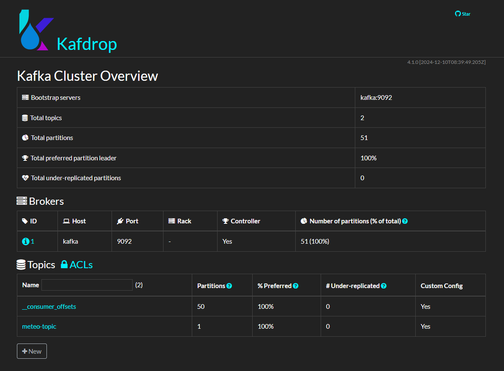
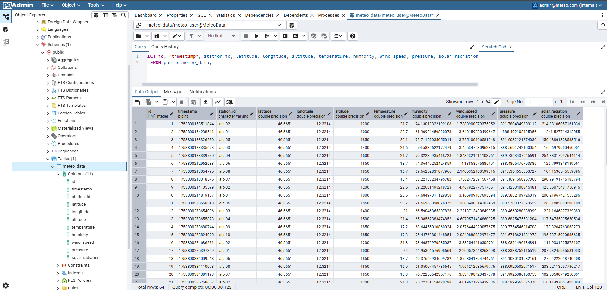

# MeteoFlow
MeteoFlow is a microservices-based data pipeline that simulates a network of distributed weather stations. Sensor data is streamed in real time using Kafka, stored in PostgreSQL, and made accessible via a RESTful API built with FastAPI.  The project showcases a full backend architecture with containerized services (Docker), real-time data streaming, database integration, and API exposure — designed to demonstrate production-ready skills for backend and data engineering roles.

# Project Architecture

- `producer` → generates realistic weather data and sends it to Kafka
- `consumer` → receives data from Kafka and saves it to PostgreSQL via REST API
- `api` → provides a REST interface for reading/writing weather data
- `postgres` → relational database for saving weather data
- `kafka + zookeeper` → message queue for decoupling generators and consumers
- `grafana` → dashboard for viewing temperature, humidity, etc.
- `pgadmin` → interface for exploring data in PostgreSQL
- `kafdrop` → interface for exploring Kafka messages

# Requirements

- Docker
- Docker Compose

# How to run the application

```bash
git clone https://github.com/sforin/MeteoFlow.git
cd meteoflow
docker-compose up --build
```

### Available Services

| Servizio    | URL                                                      |
| ----------- | -------------------------------------------------------- |
| API FastAPI | [http://localhost:8000/docs](http://localhost:8000/docs) |
| Kafka UI    | [http://localhost:9000](http://localhost:9000)           |
| Grafana     | [http://localhost:3000](http://localhost:3000)           |
| pgAdmin     | [http://localhost:5050](http://localhost:5050)           |

# Data generation example

```json
{
  "timestamp": 1753571710200164,
  "station_id": "alp-01",
  "location": {
    "latitude": 46.5651,
    "longitude": 12.3214,
    "altitude": 1000
  },
  "weather": {
    "temperature": 18.0,
    "humidity": 78.0,
    "wind_speed": 8.0,
    "pressure": 890.0,
    "solar_radiation": 210.0
  }
}
```

# Monitoring using Grafana

- Access to Grafana at http://localhost:3000
- Login `admin` / `admin`
- Dashboard `Temperature`
- Configurable varible `StationId`

# PostgreSQL database

```yaml
host: localhost
port: 5432
user: meteo_user
password: meteo_password
database: meteo_data
```

# Screenshot

- Grafana dahsboard
- Kafdrop

- pgAdmin


# License

MIT License © Stefano
